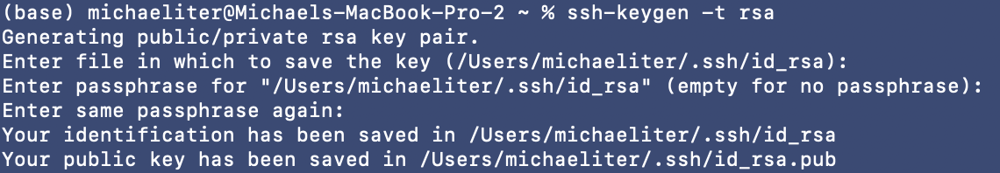
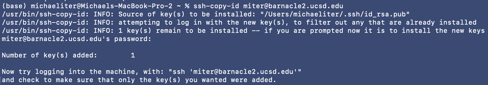

# barnacle-setup
Some info about setting up and using Barnacle2 for Knight Lab purposes

# Getting started with Barnacle

Owner: Lucas Patel
Tags: Guides and Processes

Barnacle (barnacle2.ucsd.edu) is a powerful [SLURM](https://en.wikipedia.org/wiki/Slurm_Workload_Manager) cluster designed for computationally intensive tasks and secure data access. When using Barnacle, you will have access to very expensive and powerful computing hardware enabling much faster and efficient analyses. This guide will help you get started.

## **Logging on to Barnacle**

Accessing Barnacle is straightfoward. First, make sure you’re on a UCSD network or connected to the [UCSD VPN](https://blink.ucsd.edu/technology/network/connections/off-campus/VPN/). Next, simply open a terminal and type the following (make sure to replace `<USERNAME>` with your UCSD username, which is typically the first part of your UCSD email):

```bash
ssh <USERNAME>@barnacle2.ucsd.edu
```

You will be asked to provide your password, which should match your password for other UCSD systems. No characters will appear on the screen as you type. Press enter once you’ve inputted your password, and you should be greeted with a message from Jeff that looks like this:

```bash
For cluster documentation, information on jupyterhub, useful data access hints, please see https://kldocs.ucsd.edu/projects/cluster-usage/wiki

Access is through UCSD username and password.  If someone is unable to authenticate, please contact jdereus@ucsd.edu.
```

And that’s it, you’re in!

### **(OPTIONAL) Logging on to Barnacle with SSH key**

You can configure an SSH key to avoid having to type your password in every time you access Barnacle. This involves generating a private/public key pair on your local computer if you haven’t already. You will then copy over the “public” key to the remote server (Barnacle). This can be easily accomplished in a couple of lines locally.

Note: ssh-copy-id is available on most Linux distributions and MacOS, but not Windows by default. You would need to use PowerShell (I haven’t tested this though).

```bash
ssh-keygen -t rsa
# -- Follow key gen instructions.
# -- If you don't want to set a passphrase (I didn't) just keep clicking Enter.
ssh-copy-id <USERNAME>@barnacle2.ucsd.edu
```

Example:





## **Environment Setup**

### **Creating a QIIME 2 Conda Environment with Miniforge and WGET**

Use Miniforge to create and manage conda environments for QIIME 2 and other bioinformatic tools.

Link to Qiime2: [https://docs.qiime2.org/2024.5/install/native/](https://docs.qiime2.org/2024.5/install/native/)

See the page below for some more step-by-step guidance for this:

[Configuring conda (mamba) and QIIME2 on Barnacle](conda-qiime2-config.md) 

## **General Bash Commands**

Familiarize yourself with basic bash commands for navigation and file management.

## **Login and Usage Information**

- SSH Key: Essential for secure access to Barnacle2.
- Directory Guidance: Understand the difference between **`$home`** and **`/ddn_scratch`** for appropriate data storage.

## **SLURM Essentials**

Key SLURM commands for job management:

- **`squeue -u username`**: View your jobs in the queue.
- `srun -p short -c 1 --nodes 1 --mem 32gb --pty bash` : start an interactive job
    - `-p` partition. Keep this as `short` unless you want to run something that will take 1TB or more, in which case choose `highmem`
    - `-c` number of cpus you want
    - `--nodes` number of nodes you want
    - `--mem` how much RAM you want
    - `--pty bash` start a bash shell. keep this as it is
- **`sbatch test.sbatch`**: Submit jobs.
- **`scancel test.sbatch`**: Cancel jobs.

<aside>
⚠️

Warning: Do not run any big jobs on the login node (which is what originally boots up when you ssh into barnacle. Please use `sbatch` to submit a job or `srun` to start an interactive job, which gives you a compute node that you can work normally in. I typically just do `srun` whenever I login to barnacle so that I don’t accidentally start a big job on the login node.

- Ex: while creating a conda environment seems like it would be a small job, sometimes it is not (like with qiime2) so just start an interactive job before doing so.
</aside>

## **Directory and File Management**

- Home Directory: **`/home/user_name`**
    - limited storage, so just keep scripts and important final results here
- Scratch Directory: **`/ddn_scratch/user_name`**
    - more storage, but not backed up, so keep huge, raw, or temporary files here
- Navigating Directories:
    - **`ls -a /`**: List files and directories
    - **`ls /databases/`**: List database directories

## **Understanding .sh vs .sbatch Files**

- **.sh File**: General-purpose bash script.
- **.sbatch File**: Formatted for SLURM job submission, including resource allocation and job settings.

## **Example Files**

### **test.sh**

```bash
#!/bin/bash # mauthor: leo-joseph l1joseph@ucsd.edu # purpose: test slurm functions echo'hello world'

```

### **test.sbatch**

```bash
#!/bin/bash # author: leo-joseph l1joseph@ucsd.edu # purpose: test slurm functions#SBATCH -J test #SBATCH --mail-type=ALL #SBATCH --mail-user=l1joseph@ucsd.edu #SBATCH --partition=short #SBATCH --time=00:10:00 #SBATCH --ntasks=1 #SBATCH --nodes=1 #SBATCH --mem=2gb #SBATCH --output=%x-%A_%a.out #SBATCH --error=%x-%A_%a.err echo 'hello world'

```

## **JupyterHub for UCSD**

Leverage JupyterHub for Python development and other programming tasks.

---

This guide provides the essentials to get you started with Barnacle2. For more detailed information or assistance, please contact the IT support team.

# Tmux

An invaluable tool for using a cluster like Barnacle, is `tmux`, which allows you to open multiple terminal sessions that are detachable and reattach-able. This means that you can start an interactive slurm job in a tmux session, “detach” it, then close your local computer and it will keep running on the cluster. You can then “reattach” the session whenever you come back, and it’ll be like you never left :). 

## tmux command cheat sheet

- `tmux` → start a new tmux session
- `tmux new -s name` → start a new session with a name
- `tmux ls` → list sessions
- `tmux attach` → attach to session
    - `tmux attach -t name` → attach to a specific session, if you have multiple
- `tmux kill-session -t name` → kill a specific session (will stop running)
- *special key command*: `Ctrl-b d` → detach from current session (leave it running)

## Useful Tools and Links

---

https://github.com/ohmybash/oh-my-bash — Improved CLI for bash

https://github.com/iggredible/Learn-Vim — Love or hate it, eventually you’ll want to use it

### GCC errors when installing packages? try this:

```bash
module load gcc_9.3.0
module load cmake_3.18.2
export CC=$(which gcc)
export CXX=$(which g++)
```
